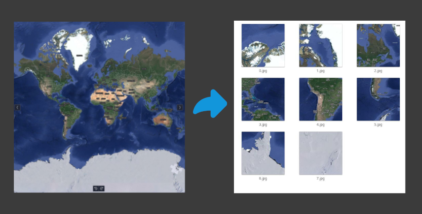

[中文](README_zh.md)|English
# split-map-tiles
5x-split-map-tiles can split the full world map into, for example, standard gis engine map tile service files.

### Usage
### Install dependencies
#### installs Python and the virtual environment:
If you haven't installed Python yet, go to the official Python website to download and install the latest version of Python. once installed, it is recommended to use a virtual environment to isolate the libraries needed for your project to avoid conflicts with libraries from other projects.
You can create a virtual environment using the following command:
```bash
python3 -m venv venv
```
#### Then activate the virtual environment:

- On Windows:
```bash
venv\Scripts\activate
```
On Windows: 
```bash 
venv\Scripts\activate
```
- On macOS/Linux:
```bash
source venv/bin/activate
```

On macOS/Linux: 
```bash
 source venv/bin/activate
```
#### Install all dependencies:
In a virtual environment, use pip to install the dependencies required by your project. In your project folder, run:

```bash
pip install -r requirements.txt
```

### Configuration file
```bash
vim .env
```

### Run
```base
python3 main.py

```

## Authentication example 
- Please run under the web proxy server . /example/example.html
- [online demo](https://fanqie.github.io/5x-split-map-tiles/example/index.html)

