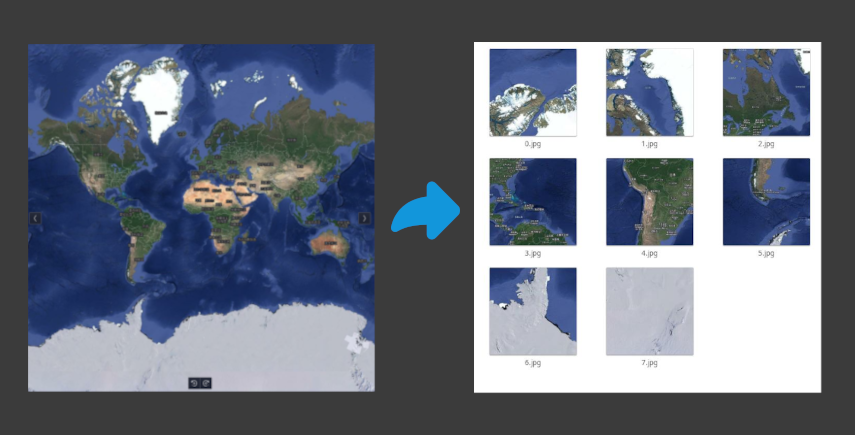

中文|[English](README_zh)
# split-map-tiles
split-map-tiles 可以将世界地图的完整地图分割为，可以支持标准gis引擎地图瓦片服务文件

## 使用方法
### 安装依赖
#### 安装 Python 和虚拟环境：
如果你还没有安装 Python，去 Python 官方网站下载并安装最新版本的 Python。安装完毕后，建议使用虚拟环境来隔离项目所需的库，以避免与其他项目的库发生冲突。
你可以使用以下命令创建虚拟环境：
```bash
python3 -m venv venv
```
#### 然后激活虚拟环境：

- 在 Windows 上：
```bash
venv\Scripts\activate
```
- 在 macOS/Linux 上：
```bash
source venv/bin/activate
```
#### 安装所有依赖项：
在虚拟环境中，使用 pip 安装项目所需的依赖项。在你的项目文件夹中，运行：

```bash
pip install -r requirements.txt
```

### 配置文件
```bash
vim .env
```

### 运行
```base
python3 main.py

```

## 验证示例 
- 请在web代理服务器下运行 ./example/example.html
- 需要自己引入cesium
